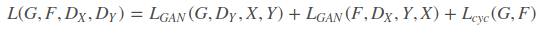

# CycleGan
Image-to-image translation is to learn the mapping between an input image and an output image using a training set of aligned
image pairs. However, for many tasks, paired training data will not be available. 

CycleGan is an approach for learning to translate an image from a source domain X to a target domain Y in the absence of paired examples. **The innovation of CycleGAN is that it can be achieved between the source and target domains, and we don't need to establish a one-to-one mapping between the training data. **

This method performs a two-step transformation on the source domain image by first attempting to map it to the target domain
and then returning to the source domain to obtain a secondary generated image.

CycleGAN is essentially two mirror-symmetrical GANs that form a ring network. 
In fact, as long as you understand half of the one-way GAN is equivalent to understanding the entire CycleGAN.

## One-way GAN

The figure above is a schematic diagram of a one-way GAN. We want to be able to convert the image of domain A (named a) into
a picture of domain B (named image b).
In order to achieve this process, we need two generators GAB and GBA to convert the images of domain A and domain B to each other.

### Adversarial Loss
binary classfication 

### Cycle Consistency Loss

## CycleGAN

CycleGAN is actually an A→B one-way GAN plus a B→A one-way GAN. The two GANs share two generators, each with a discriminator, so adding up to a total of two discriminators and two generators. A one-way GAN has two losses, and CycleGAN adds up to a total of four losses.
### Adversarial Loss

### Cycle Consistency Loss

### Full Objective

## Results

