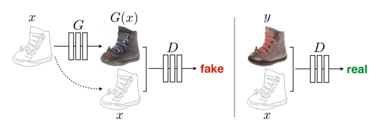

# Introduce

Many problems in image processing, graphics, and vision involve translating an input image into a corresponding output image.
These problems are often treated with application-specific algorithms, even though the setting is always the same: map pixels to pixels.
Conditional adversarial nets are a general-purpose solution that appears to work well on a wide variety of these problems. Here we show
results of the method on several. In each case we use the same architecture and objective, and simply train on different data.

# Method

Training a conditional GAN to map edges→photo. The discriminator, D, learns to classify between fake (synthesized by the generator) and real {edge, photo} tuples. The generator, G, learns to fool the discriminator. Unlike an unconditional GAN, both the generator and discriminator observe the input edge map.
