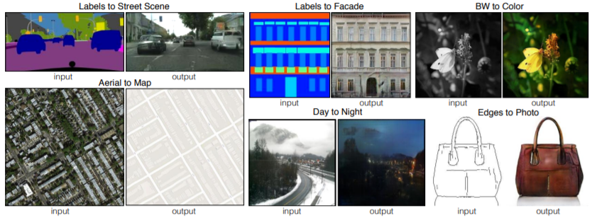
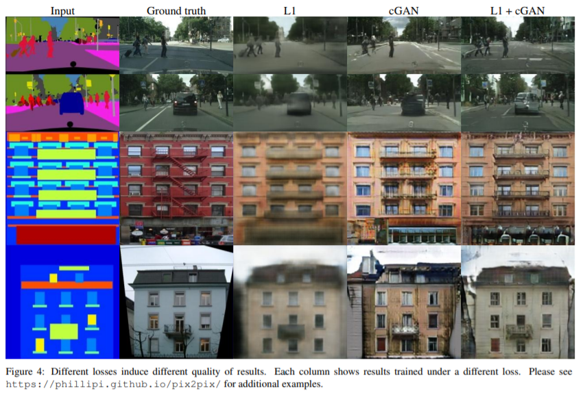
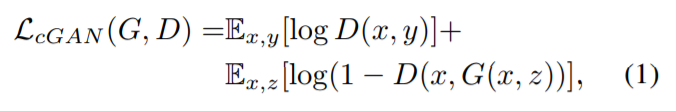
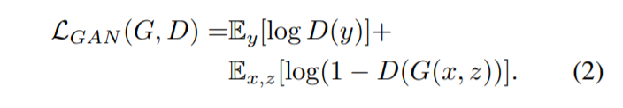
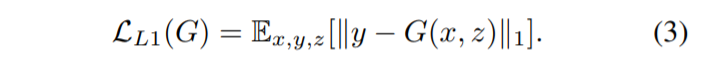
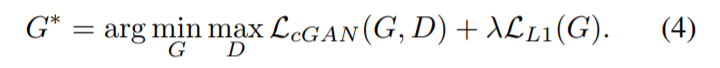
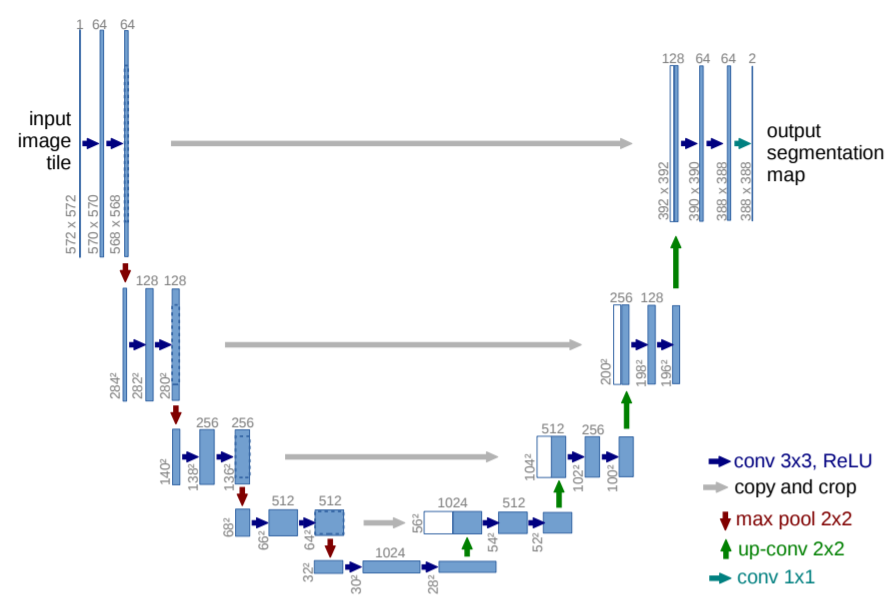
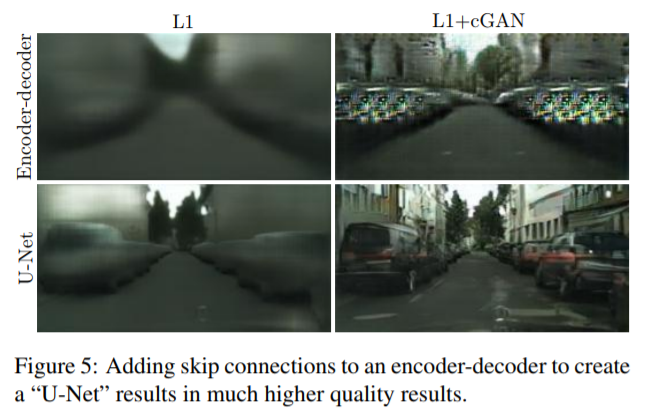
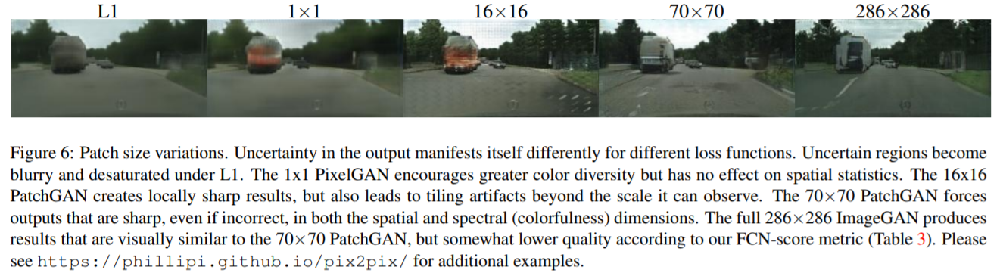

# Introduce

Many problems in image processing, graphics, and vision involve translating an input image into a corresponding output image.
These problems are often treated with application-specific algorithms, even though the setting is always the same: map pixels to pixels.
Conditional adversarial nets are a general-purpose solution that appears to work well on a wide variety of these problems. Here several results of the method, used the same architecture and objective, and simply train on different data.

# Method

Training a conditional GAN to map edges→photo. The discriminator, D, learns to classify between fake (synthesized by the generator) and real {edge, photo} tuples. The generator, G, learns to fool the discriminator. Unlike an unconditional GAN, both the generator and discriminator observe the input edge map.

## Objective

The objective of a conditional GAN can be expressed as: 
 
 
To test the importance of conditioning the discriminator:
 
 
 
Mix the GAN objective with a more traditional loss: 
 
 
Final objective is: 

##  Network architectures
**Both generator and discriminator use modules of the form convolution-BatchNorm-ReLu**
### Generator
**A defining feature of image-to-image translation problems
is that they map a high resolution input grid to a high resolution
output grid.**
Many previous solutions to problems in this area have used an **encoder-decoder network**. In such a network, the input is passed through a series of layers that progressively downsample, until a bottleneck layer, at which point the process is reversed. Such a network requires that all information flow pass through all the layers, including the bottleneck. For many image translation problems, there is a great deal of low-level information shared between the input and output, and it would be desirable to shuttle this information directly across the net. For example, in the case of image colorizaton, the input and output share the location of prominent edges.

To give the generator a means to circumvent the bottleneck for information like this, we add skip connections, following the general shape of a **“U-Net”**. Specifically, they add skip connections between each layer *i* and layer *n − i*, where n is the total number of layers. Each skip connection simply concatenates all channels at layer *i* with those at layer *n − i*.

### Discriminator
**Markovian discriminator (PatchGAN)**
**This motivates restricting the GAN discriminator to only model high-frequency structure, relying on an L1 term to force low-frequency correctness (Eqn. 4)**. In order to model high-frequencies, it is sufficient to restrict our attention to the structure in local image patches. Therefore, they design a discriminator architecture – *PatchGAN* – that only penalizes structure at the scale of patches. This discriminator tries to classify if each *N × N* patch in an image is real or fake. They run this discriminator convolutationally across the image, averaging all responses to provide the ultimate output of D.

# Advantages
Pix2Pix ingeniously uses GAN's framework to provide a general framework for a class of "Image-to-Image Translation" problems. Use **U-Net** to enhance the details and use **PatchGAN** to process the high frequency parts of the image.
